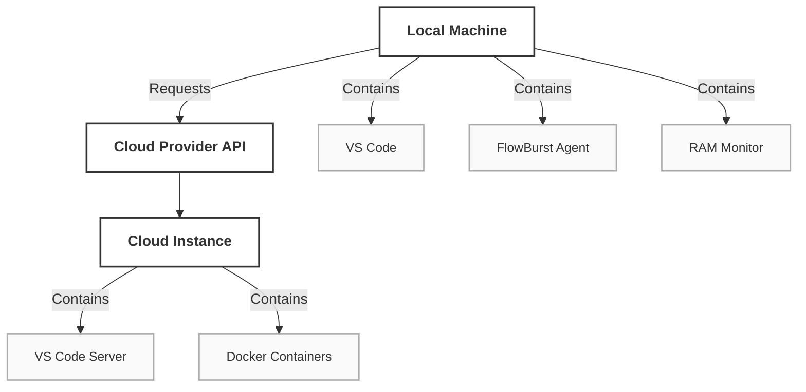

# FlowBurst: Seamless Hybrid Development Environment  
### A project by Rajat Bansal  

## Table of Contents  
- [Problem Statement](#problem-statement)  
- [Proposed Solution](#proposed-solution)  
- [Abstract](#abstract)  
- [How Are We Doing It?](#how-are-we-doing-it)  
  - [Architecture Overview](#architecture-overview)  
  - [Core Components](#core-components)  
  - [Workflow](#workflow)  
- [Milestones](#milestones)  
- [Conclusion](#conclusion)  

---

## Problem Statement  
Modern developers face two critical challenges:  

### **Resource Limitations:**  
- Local machines (especially low-end laptops) struggle with RAM/CPU-heavy tasks (e.g., AI/ML, large codebases).  
- System crashes and sluggish performance disrupt workflow.  

### **Cloud Complexity:**  
- Tools like GitHub Codespaces/Gitpod are cloud-only, expensive, and require YAML/config expertise.  
- No solution bridges local development familiarity with on-demand cloud scalability.  

### **Real-World Impact:**  
- A student training a TensorFlow model on a 4GB RAM laptop faces constant crashes.  
- A startup developer can’t afford **$50/month** for always-on cloud instances.  

---

## Proposed Solution  
**FlowBurst** is a **hybrid development environment** that:  

### **Starts Locally**  
- Uses familiar **VS Code** and **Docker containers**.  

### **Scales to Cloud Automatically**  
- Monitors **RAM/CPU in real-time**.  
- Proactively spins up **pre-configured cloud instances** when thresholds are breached.  

### **Maintains Workflow Continuity**  
- Mirrors **VS Code settings, extensions, and files** between **local ↔ cloud**.  
- No manual configuration or context switching.  

### **Key Innovations:**  
✅ **Zero-Config Hybrid Model** – Developers stay in their flow.  
✅ **Cost-Efficient Cloud Bursting** – Pay only for cloud time used.  

---

## Abstract  
**FlowBurst** eliminates the trade-off between local development comfort and cloud scalability.  

By integrating **real-time resource monitoring, automated cloud provisioning, and seamless VS Code integration**, it allows developers to:  

- **Code locally** until system limits are reached.  
- **Automatically shift to a cloud instance** without disrupting their workflow.  
- **Return to local development** once resources free up.  

**Built for low-spec machines and cost-conscious teams, FlowBurst democratizes access to scalable development environments.**  

---

## How Are We Doing It?  

### **Architecture Overview**  




---

### **Core Components**  

#### **1. Local Resource Monitor**  
- **Tech:** bash script   
- **Function:** Tracks RAM/CPU usage; triggers cloud provisioning  

#### **2. Cloud Orchestrator**  
- **Tech:** CloudPlatform API + Terraform  
- **Function:** Spins up pre-configured VMs with Docker, VS Code Server, and SSH  

#### **3. Pre-Configured Images**  
- **Tech:** Packer-built snapshots  
- **Includes:** Python, Node.js, Java dev containers + VS Code extensions  

#### **4. VS Code Integration**  
- **Tech:** VS Code Remote-SSH extension + custom automation  
- **Function:** Auto-connects to cloud instance and syncs files/settings  

---

### **Workflow**  

#### **1. Local Development**  
```
$ FlowBurst start  # User starts coding locally
```

#### **2. Resource Threshold Breached**  
Agent detects **80% RAM usage** → prompts user:  
```
FlowBurst  
Low RAM! Switch to cloud?  
[Y/n]
```

#### **3. Cloud Provisioning**  
- Backend calls **Cloud Provider's API** → creates VM **under 60 seconds**.  

#### **4. Auto-Connection**  
- **VS Code reloads workspace** on the cloud instance via SSH.  

#### **5. Post-Session Cleanup**  
- **Files synced** back to local machine.  
- **VM terminated** after **30 minutes of inactivity**.  

#### **Example User Cost:**  
A developer using cloud instances for **10 hours/month**:  
```
$0.015/min × 600 mins = $9 + $12 subscription = $21/month
```

---

## Milestones  
📌 **Week 4:** First cloud instance spun via CLI.  
📌 **Week 8:** Alpha testers validate hybrid workflow.  
📌 **Week 12:** Publish VS Code extension to marketplace.  
📌 **Week 18:** Launch on **Product Hunt + Hacker News**.  

---

## Conclusion  
**FlowBurst** reimagines development environments by blending the best of **local and cloud worlds**.  

By prioritizing **user flow** and **cost efficiency**, it empowers developers to **focus on code—not infrastructure**.  

### 🚀 Get Involved:  
⭐ **Star the repo**  
🔧 **Contribute to the CLI**  
🚀 **Join our beta program**  
